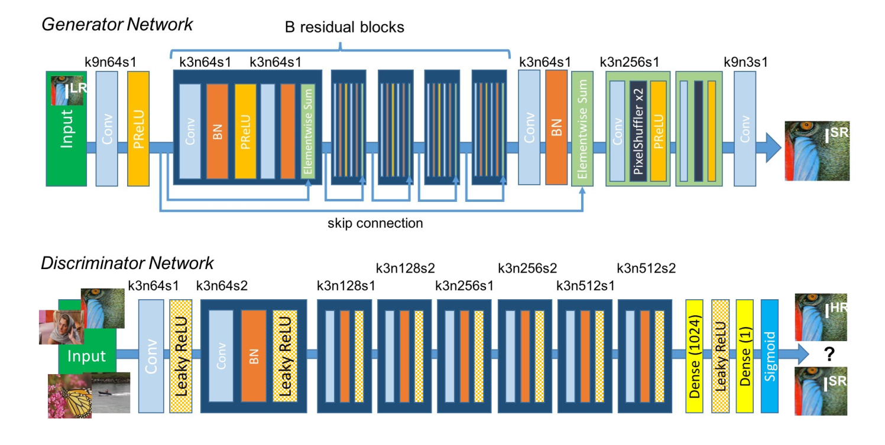
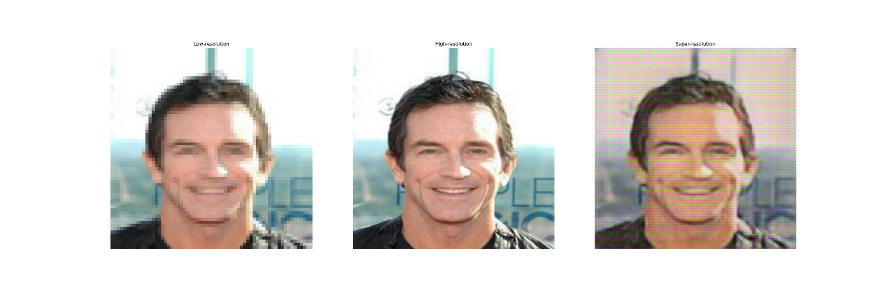
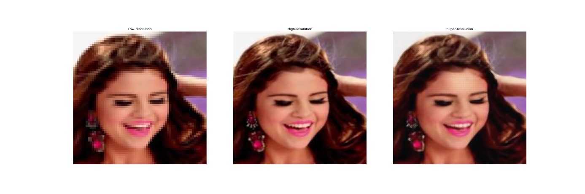
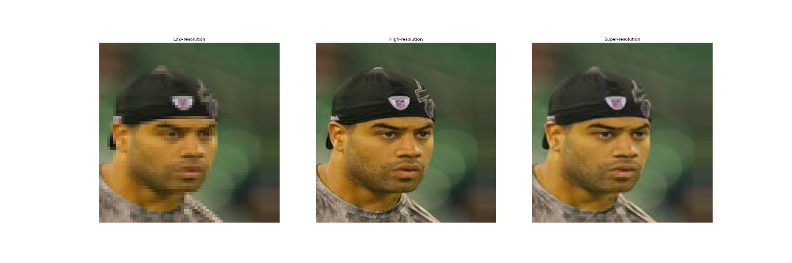
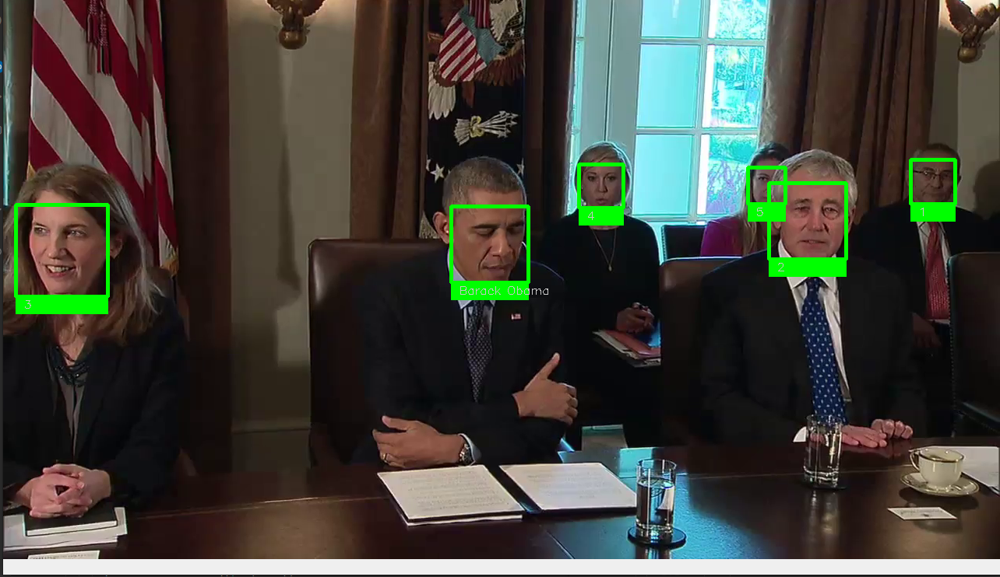
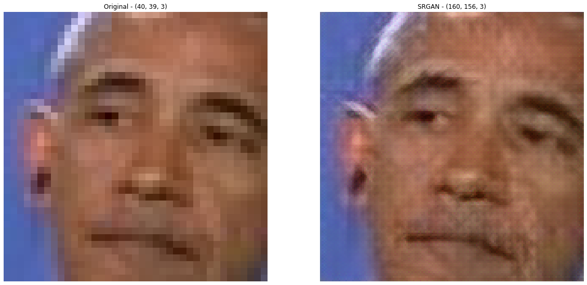

# Super resolution faces captured from video clips

Algorith detecting, recognizing and enhancing resolutions of captured faces faces from viedo clips. 

## 1. Super Resolution Generative Adversarial Network
First part is SRGAN model - a seminal work that is capable of generating realistic textures during single image super-resolution - which is being trained on ["CelebA Dataset"](https://mmlab.ie.cuhk.edu.hk/projects/CelebA.html) 

Presented SRGAN is an implementation of ["Photo-Realistic Single Image Super-Resolution Using a Generative Adversarial Network"](https://arxiv.org/abs/1609.04802)

### 1.1 Architecture
SRGAN is a generative adversarial network for single image super-resolution. It uses a perceptual loss function which consists of an adversarial loss and a content loss. The adversarial loss pushes the solution to the natural image manifold using a discriminator network that is trained to differentiate between the super-resolved images and original photo-realistic images. 

Architecture of Generator and Discriminator Network with corresponding kernel size (k), number of feature maps
(n) and stride (s) indicated for each convolutional layer.

### 1.2 Inputs and oututs
As inputs goes low-resolution images and high-resolution images and the generator based on them as outputs generate super-resoultion images from low-resolution ones. Below are presented some samples form training process:

Results after 500 epchos

Results after 20 000 epchos

Results after 50 000 epchos

## 2. Face detection and recognition
Second part is detecting, recognizing known faces and improving resolution by using generator from SRGAN on viedo clips.

Face detection and recognition.

Super-resolution face enhancment
